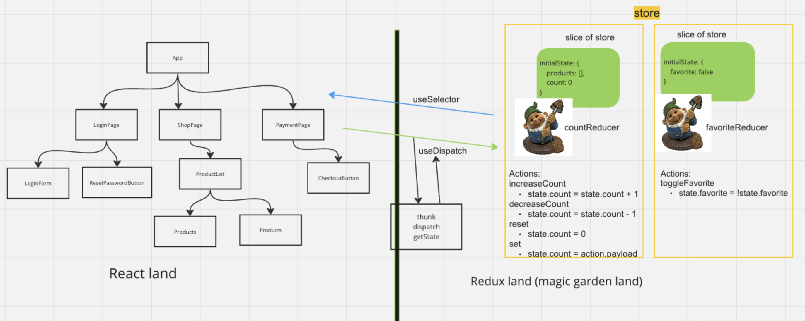

# Getting Started with Create React App

This project was bootstrapped with [Create React App](https://github.com/facebook/create-react-app).

## Setup
- Git clone this repo
- Run `npm install` to install all the dependencies listed in package.json
- Run `npm run start` to start the local development server

## Kyna
This repo follows the The Post Feed project in the Redux Kyna course, modules 3 and 4, but with some modified examples matching Tessa's lecture
- The `main` branch has all the code from the end of the Redux Thunks module 3
- The `redux-auth` branch has all the code from the end of the Redux Auth module 4
- View [this pull request](https://github.com/TechmongersNL/fs03-redux-thunks/pull/1) to see the difference between the two 

## Update diagram with thunks

## Other Redux Intro repo:
https://github.com/TechmongersNL/fs03-redux

